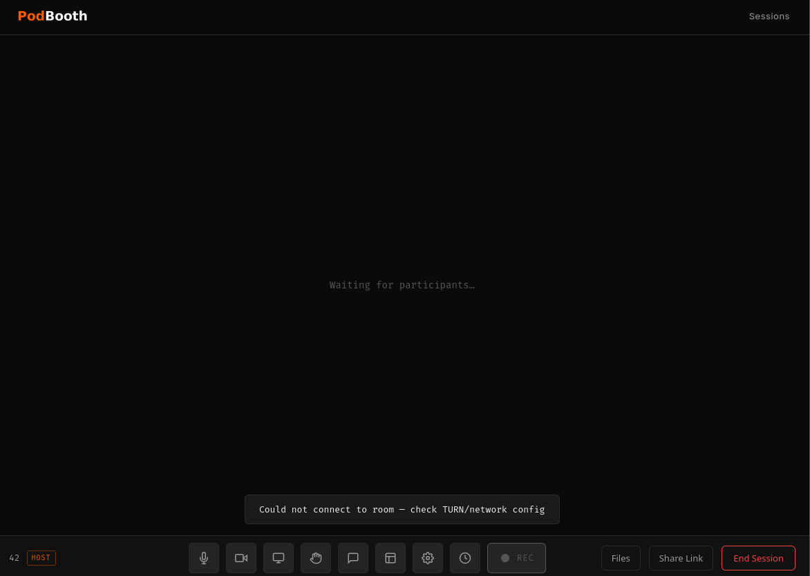

# PodBooth

Self-hosted remote podcast recording studio. Each participant records locally in the browser — separate audio and video tracks, no quality loss.

## Screenshots

<table>
  <tr>
    <td><br/><sub>Home — create a session</sub></td>
    <td><br/><sub>Pre-join — device check</sub></td>
  </tr>
  <tr>
    <td><br/><sub>Studio</sub></td>
    <td><br/><sub>Studio — chat panel</sub></td>
  </tr>
  <tr>
    <td><br/><sub>Studio — topic timer</sub></td>
    <td><br/><sub>Sessions dashboard</sub></td>
  </tr>
</table>

---

## Stack

- **FastAPI** — session management, token generation, chunked upload, file assembly
- **LiveKit** — WebRTC SFU (self-hosted via Docker)
- **ffmpeg** — chunk assembly into final WAV/MP4 files
- **Vanilla JS** — browser recording via MediaRecorder API

---

## Quick Start

### 1. Get the compose file

```bash
curl -O https://raw.githubusercontent.com/fuzzymistborn/podbooth/main/compose.yml
curl -O https://raw.githubusercontent.com/fuzzymistborn/podbooth/main/.env.example
curl -o livekit/livekit.yaml --create-dirs \
  https://raw.githubusercontent.com/fuzzymistborn/podbooth/main/livekit/livekit.yaml
```

Or clone the repository if you want the full source:

```bash
git clone https://github.com/fuzzymistborn/podbooth.git
cd podbooth
```

### 2. Configure environment

**Option A — .env file (recommended)**

```bash
cp .env.example .env
```

Edit `.env` with your values. See [Environment Variables](#environment-variables) below.

**Option B — inline in compose.yml**

Comment out the `env_file` line in `compose.yml` and fill in the `environment` block directly. This is equivalent — choose whichever fits your workflow.

> **Note:** If you use Option B, the `${TURN_*}` variable references in the `coturn` command block also need to be replaced with literal values.

### 3. Configure LiveKit

The LiveKit API key and secret are arbitrary strings you generate yourself — there's no external service to register with. The key and secret must match between `livekit/livekit.yaml` and your environment variables.

Generate them with:

```bash
# API key — short, readable identifier
openssl rand -hex 12

# API secret — longer random value
openssl rand -base64 32
```

Edit `livekit/livekit.yaml` and put the generated values in the `keys` block:

```yaml
keys:
  your_api_key: your_api_secret
```

Set the same values for `LIVEKIT_API_KEY` and `LIVEKIT_API_SECRET` in your `.env` file (or compose `environment:` block).

If you're using coturn for TURN, you also need to update the TURN credentials in `livekit/livekit.yaml`. Like the LiveKit key/secret, the TURN username and password are arbitrary strings you choose — there's no external account. They just need to match in two places: `livekit/livekit.yaml` and your `.env` file. The `compose.yml` automatically passes the env var values to coturn, so no changes are needed there.

```bash
# TURN username — any short string
TURN_USER=turnuser

# TURN password — generate a random one
openssl rand -base64 24
```

Update `livekit/livekit.yaml` with the same values and your server's IP:

```yaml
rtc:
  turn_servers:
    - host: 192.168.1.10   # your server's LAN or public IP (TURN_EXTERNAL_IP)
      port: 3478
      protocol: udp
      username: turnuser   # must match TURN_USER in .env
      credential: change-me  # must match TURN_PASSWORD in .env
```

### 4. Start

```bash
docker compose up -d
```

The app runs on port `8100`. Put Caddy or nginx in front for TLS — browsers require HTTPS for microphone and camera access.

---

## Environment Variables

### LiveKit

| Variable | Required | Description |
|---|---|---|
| `LIVEKIT_API_KEY` | Yes | API key — must match the `keys` block in `livekit/livekit.yaml` |
| `LIVEKIT_API_SECRET` | Yes | API secret — must match the `keys` block in `livekit/livekit.yaml` |
| `LIVEKIT_URL` | Yes | Internal URL the app uses to reach LiveKit. Keep `ws://livekit:7880` when using this compose stack |
| `LIVEKIT_PUBLIC_URL` | Yes | Public WebSocket URL that browsers connect to (e.g. `wss://your-server.example.com:7880`) |

### TURN / coturn

| Variable | Required | Description |
|---|---|---|
| `TURN_EXTERNAL_IP` | Yes | LAN or public IP that clients can reach coturn on |
| `TURN_USER` | Yes | TURN username — also set in `livekit/livekit.yaml` |
| `TURN_PASSWORD` | Yes | TURN password — also set in `livekit/livekit.yaml` |

### App

| Variable | Required | Description |
|---|---|---|
| `SECRET_KEY` | Yes | Random string for signing session cookies. Generate with `openssl rand -base64 32` |
| `BASE_URL` | Yes | Public URL of the app, e.g. `https://your-server.example.com` |
| `RECORDINGS_DIR` | No | Path inside the container for recordings. Default: `/recordings` |
| `TZ` | No | Timezone for session timestamps and recording folder dates (e.g. `America/New_York`). Defaults to `UTC` |
| `HOST_PASSWORD` | No | Password for the host UI. Leave blank to disable authentication |

---

## Usage

1. Go to `/` → enter a session title → **Create Session**
2. You land in the studio as host with a share link
3. Click **Share Link** → copy the guest URL → send to participants
4. Guests open the link, check their devices, enter their name, and join
5. Host clicks **REC** to start — all participants record locally and upload in real time
6. Host clicks **REC** again or **End Session** to stop
7. Files are assembled server-side: `recordings/{date}-{title}/{participant}/audio.wav` + `video.mp4`
8. Download from `/dashboard`

---

## Output Files

Per participant, per session:

```
recordings/
  2025-01-15-Episode 42/
    Alice/
      audio.wav    ← 48kHz 24-bit PCM, lossless
      video.mp4    ← H.264, 1080p, ~8 Mbps
    Bob/
      audio.wav
      video.mp4
```

`audio.wav` and `video.mp4` are produced independently. `video.mp4` has the participant's mic audio mixed in so it can be used directly in an editor without needing to manually sync tracks.

---

## Architecture Notes

- **Client-side recording**: Each browser captures raw mic/camera before any WebRTC transcoding. Quality is the actual source, not the compressed stream.
- **Truly lossless audio**: Audio is captured as raw Float32 PCM via an `AudioWorklet` from a dedicated *unprocessed* mic stream (echo cancellation / noise suppression off), then written server-side to 24-bit WAV. The call itself still uses processed audio. Browsers without AudioWorklet fall back to 320 kbps Opus.
- **Chunked upload**: Audio flushes every 5s; video MediaRecorder fires every 5s. Uploads run through a per-track serialized queue with retries, so chunks land in order and `finalize` only fires once the queue drains — no race between the final chunk and assembly.
- **Assembly by byte-concatenation**: MediaRecorder chunks after the first are continuation data, not standalone files, so chunks are byte-concatenated into one source file, then ffmpeg runs once. Video already in H.264 is remuxed with `-c:v copy` (no re-encode); VP8/VP9 is transcoded to H.264 CRF 18.
- **Cross-browser**: MIME fallback chain includes `video/mp4` and `audio/mp4` for Safari.
- **Recording sync**: Start/stop broadcasts over the LiveKit data channel; a 10s status poll reconciles missed messages and catches late joiners. If the host drops (detected via `is_host` in token metadata), guests stop recording.
- **Persistence**: Sessions are stored in `.sessions.json` so they survive container restarts.

---

## TURN / NAT Traversal

Guests on a different network segment need a TURN relay for WebRTC to work.

### Option A — coturn (default)

`coturn` runs as a sidecar in `compose.yml` and is wired into `livekit/livekit.yaml` under `rtc.turn_servers`. Set `TURN_USER`, `TURN_PASSWORD`, and `TURN_EXTERNAL_IP` in your environment. Works for any guest regardless of network.

### Option B — Tailscale

If all participants are on the same Tailnet, Tailscale handles NAT traversal natively and coturn is not needed. Update `livekit/livekit.yaml`:

```yaml
rtc:
  tcp_port: 7881
  udp_port: 7882
  port_range_start: 50000
  port_range_end: 50200
  node_ip: 100.x.x.x   # your server's Tailscale IP
  # no turn_servers block needed
```

**Note:** this only works if every participant is connected to your Tailnet. External guests without Tailscale will fail to reach the WebRTC media path. For mixed audiences, keep coturn running.

---

## Building Locally

The prebuilt image at `ghcr.io/fuzzymistborn/podbooth` tracks the `main` branch. To build from source, comment out the `image:` line in `compose.yml` and uncomment `build: .`.

---

## Roadmap

- Automatic transcription via WhisperX
- Preview/replay in dashboard
