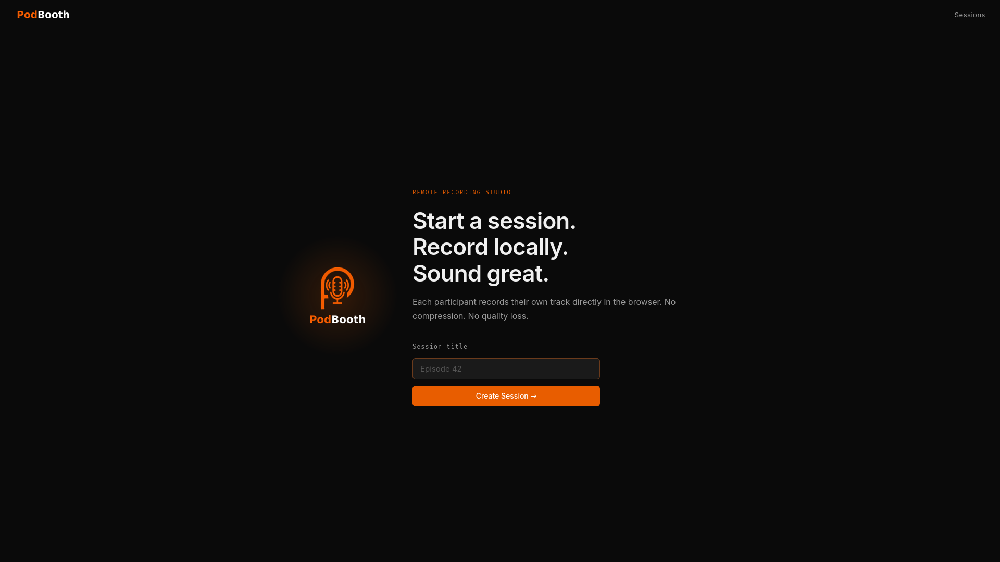
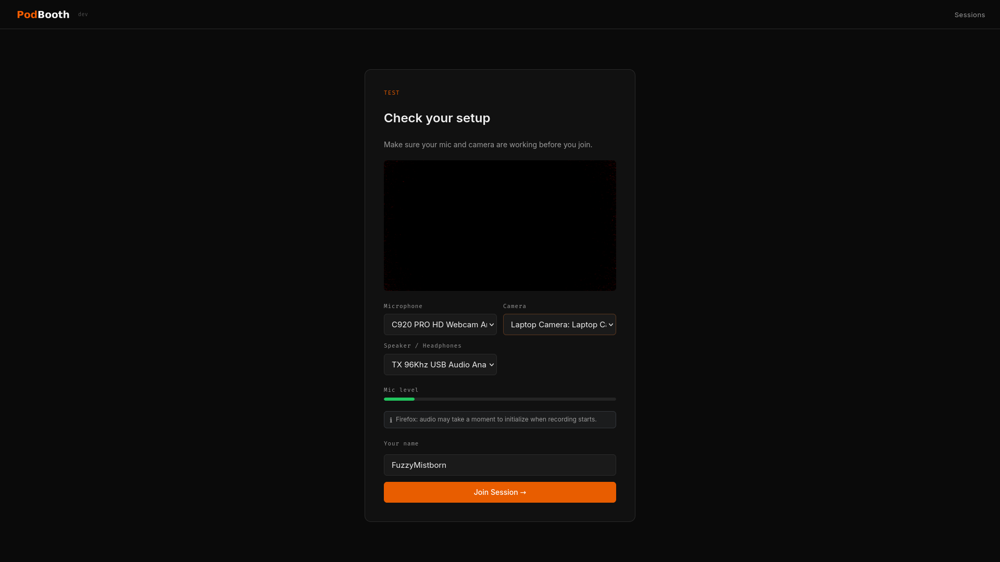
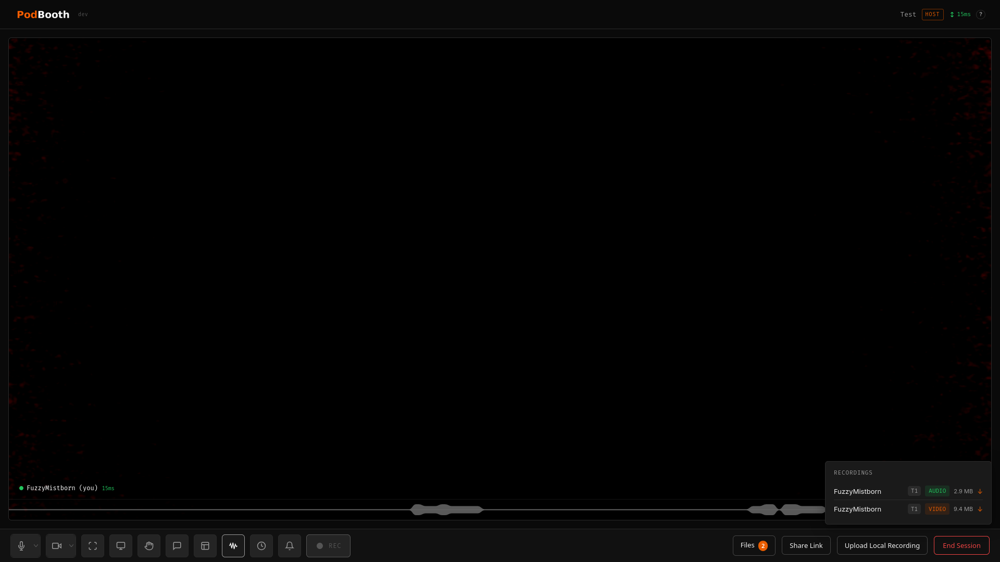
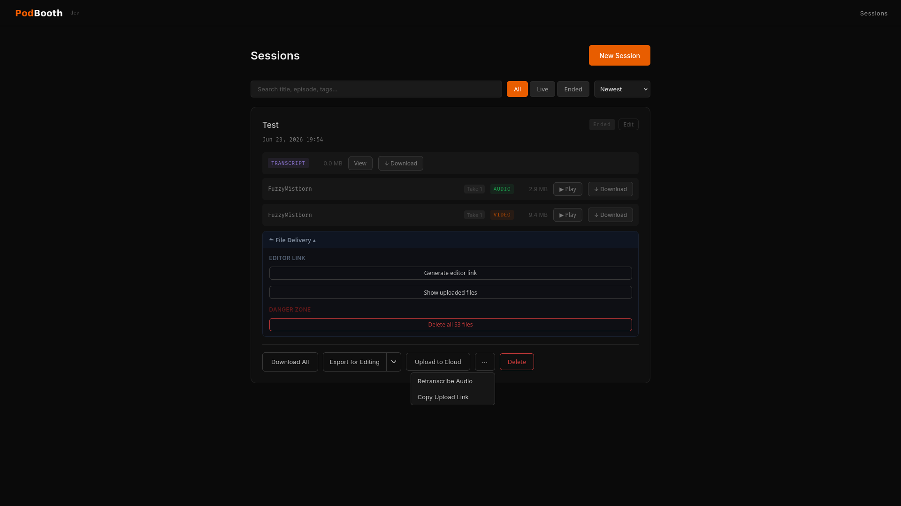
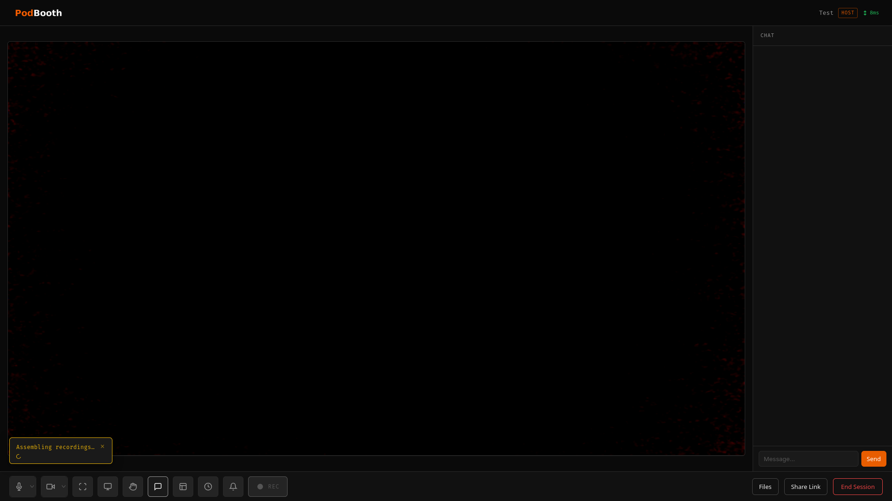
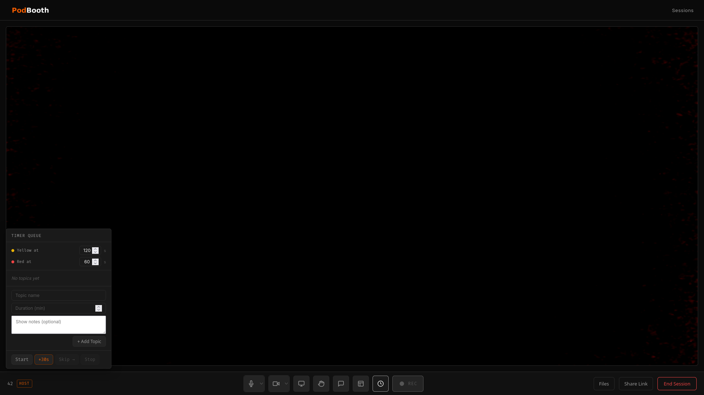
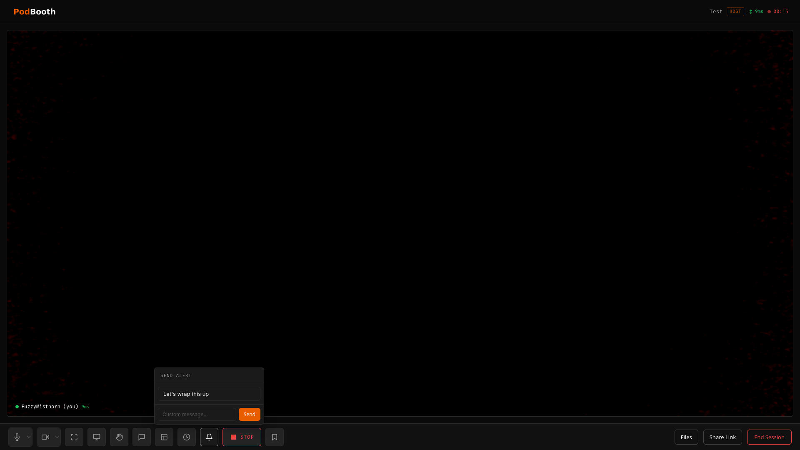
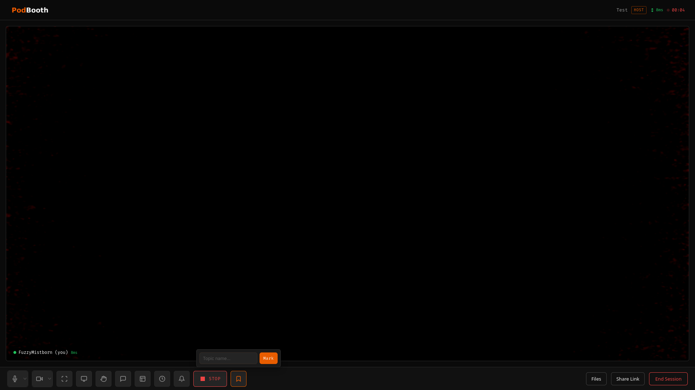

# PodBooth

Self-hosted remote podcast recording studio. Each participant records locally in the browser — separate audio and video tracks, no quality loss.

I made this largely because while tools like Zencastr, Riverside, and Squadcast exist, they are imperfect and most require a subscription fee.  I wanted to build something that could be self-hostable but have the same functionality.  I also wanted to add in a few things that I felt were missing (like screen sharing, sending visible alerts, clock/timer, etc.  So while this may be somewhat bespoke for me and my fellow hosts on the [BitFlip Show Podcast](https://bitflip.show), I tried to design it to be generic and usable for others.

## Screenshots

<table>
  <tr>
    <td><br/><sub>Home — create a session</sub></td>
    <td><br/><sub>Pre-join — device check</sub></td>
  </tr>
  <tr>
    <td><br/><sub>Studio — live recording</sub></td>
    <td><br/><sub>Sessions dashboard</sub></td>
  </tr>
</table>

<details>
<summary>More screenshots</summary>
<br/>
<table>
  <tr>
    <td><br/><sub>Chat panel</sub></td>
    <td><br/><sub>Topic timer</sub></td>
  </tr>
  <tr>
    <td><br/><sub>Send alert</sub></td>
    <td><br/><sub>Topic marker</sub></td>
  </tr>
</table>
</details>

---

## Stack

- **FastAPI** — session management, token generation, chunked upload, file assembly
- **LiveKit** — WebRTC SFU (self-hosted via Docker)
- **ffmpeg** — chunk assembly into final WAV/MP4 files
- **Vanilla JS** — browser recording via MediaRecorder API

---

## Quick Start

### 1. Get the compose file

```bash
curl -O https://raw.githubusercontent.com/fuzzymistborn/podbooth/main/compose.yml
curl -O https://raw.githubusercontent.com/fuzzymistborn/podbooth/main/.env.example
curl -o livekit/livekit.yaml --create-dirs \
  https://raw.githubusercontent.com/fuzzymistborn/podbooth/main/livekit/livekit.yaml
```

Or clone the repository if you want the full source:

```bash
git clone https://github.com/fuzzymistborn/podbooth.git
cd podbooth
```

### 2. Configure environment

**Option A — .env file (recommended)**

```bash
cp .env.example .env
```

Edit `.env` with your values. See [Environment Variables](#environment-variables) below.

**Option B — inline in compose.yml**

Comment out the `env_file` line in `compose.yml` and fill in the `environment` block directly. This is equivalent — choose whichever fits your workflow.

> **Note:** If you use Option B, the `${TURN_*}` variable references in the `coturn` command block also need to be replaced with literal values.

### 3. Configure LiveKit

The LiveKit API key and secret are arbitrary strings you generate yourself — there's no external service to register with. The key and secret must match between `livekit/livekit.yaml` and your environment variables.

Generate them with:

```bash
# API key — short, readable identifier
openssl rand -hex 12

# API secret — longer random value
openssl rand -base64 32
```

Edit `livekit/livekit.yaml` and put the generated values in the `keys` block:

```yaml
keys:
  your_api_key: your_api_secret
```

Set the same values for `LIVEKIT_API_KEY` and `LIVEKIT_API_SECRET` in your `.env` file (or compose `environment:` block).

If you're using coturn for TURN, you also need to update the TURN credentials in `livekit/livekit.yaml`. Like the LiveKit key/secret, the TURN username and password are arbitrary strings you choose — there's no external account. They just need to match in two places: `livekit/livekit.yaml` and your `.env` file. The `compose.yml` automatically passes the env var values to coturn, so no changes are needed there.

```bash
# TURN username — any short string
TURN_USER=turnuser

# TURN password — generate a random one
openssl rand -base64 24
```

Update `livekit/livekit.yaml` with the same values and your server's IP:

```yaml
rtc:
  turn_servers:
    - host: 192.168.1.10   # your server's LAN or public IP (TURN_EXTERNAL_IP)
      port: 3478
      protocol: udp
      username: turnuser   # must match TURN_USER in .env
      credential: change-me  # must match TURN_PASSWORD in .env
```

### 4. Start

```bash
docker compose up -d
```

The app runs on port `8100`. Put Caddy or nginx in front for TLS — browsers require HTTPS for microphone and camera access.

---

## Environment Variables

### LiveKit

| Variable | Required | Description |
|---|---|---|
| `LIVEKIT_API_KEY` | Yes | API key — must match the `keys` block in `livekit/livekit.yaml` |
| `LIVEKIT_API_SECRET` | Yes | API secret — must match the `keys` block in `livekit/livekit.yaml` |
| `LIVEKIT_URL` | Yes | Internal URL the app uses to reach LiveKit. Keep `ws://livekit:7880` when using this compose stack |
| `LIVEKIT_PUBLIC_URL` | Yes | Public WebSocket URL that browsers connect to (e.g. `wss://your-server.example.com:7880`) |

### TURN / coturn

| Variable | Required | Description |
|---|---|---|
| `TURN_EXTERNAL_IP` | Yes | LAN or public IP that clients can reach coturn on |
| `TURN_USER` | Yes | TURN username — also set in `livekit/livekit.yaml` |
| `TURN_PASSWORD` | Yes | TURN password — also set in `livekit/livekit.yaml` |

### App

| Variable | Required | Description |
|---|---|---|
| `SECRET_KEY` | Yes | Random string for signing session cookies. Generate with `openssl rand -base64 32` |
| `BASE_URL` | Yes | Public URL of the app, e.g. `https://your-server.example.com` |
| `RECORDINGS_DIR` | No | Path inside the container for recordings. Default: `/recordings` |
| `TZ` | No | Timezone for session timestamps and recording folder dates (e.g. `America/New_York`). Defaults to `UTC` |
| `HOST_PASSWORD` | No | Password for the host UI. Leave blank to disable authentication |
| `RETENTION_DAYS` | No | Delete sessions older than this many days on startup. Default: `0` (disabled) |
| `LOG_LEVEL` | No | Python logging level: `DEBUG`, `INFO`, `WARNING`, `ERROR`. Default: `INFO` |

### Transcription (WhisperX)

| Variable | Required | Description |
|---|---|---|
| `WHISPERX_API_URL` | No | Base URL of a [whisperx-api](https://github.com/macnow/whisperx-api) server (e.g. `http://whisperx:8000`). Leave unset to disable transcription |
| `WHISPERX_MODEL` | No | Faster-Whisper model to use. Default: `large-v3-turbo` |
| `WHISPERX_LANGUAGE` | No | Force a language code (e.g. `en`, `fr`). Leave unset for automatic detection |

### Outline Wiki Integration

Set both variables to enable pulling show notes from an [Outline](https://www.getoutline.com) document into a session before recording.

| Variable | Required | Description |
|---|---|---|
| `OUTLINE_API_URL` | Yes (to enable) | Base URL of your Outline instance, e.g. `https://wiki.example.com` |
| `OUTLINE_API_KEY` | Yes (to enable) | Outline API token (read-only scope is sufficient) |

Once configured, the host can click **Sync Outline** in the studio, paste an Outline document ID or full document URL, and import the show notes in one click. A **Refresh** button re-pulls from the same document without re-entering the ID.

**Document tagging** — only the content between the following marker tags is imported; everything else in the document (pre-show planning, post-production notes, etc.) is ignored:

```
<!- podbooth -!>
## Topic One (10 min)
Notes for topic one.

## Topic Two (5 min)
Notes for topic two.
<!- /podbooth -!>
```

H2 headings inside the tagged region are parsed as **timer topics**. A duration in parentheses (e.g. `(10 min)`) is extracted as the topic's countdown time and stripped from the display name. `### Links` sub-sections and bare URLs are excluded from the imported notes body.

### Cloud Upload — Nextcloud

Set all three required variables to enable uploading recordings to a Nextcloud instance via WebDAV.

| Variable | Required | Description |
|---|---|---|
| `NEXTCLOUD_URL` | Yes (to enable) | Base URL of your Nextcloud instance, e.g. `https://nextcloud.example.com` |
| `NEXTCLOUD_USER` | Yes (to enable) | Nextcloud username |
| `NEXTCLOUD_PASSWORD` | Yes (to enable) | Nextcloud password (or app password) |
| `NEXTCLOUD_UPLOAD_PATH` | No | Folder prefix inside your Nextcloud to upload into. Default: `PodBooth` |

### Cloud Upload — FileBrowser

Set all three required variables to enable uploading recordings to a [FileBrowser](https://filebrowser.org) instance.

| Variable | Required | Description |
|---|---|---|
| `FILEBROWSER_URL` | Yes (to enable) | Base URL of your FileBrowser instance, e.g. `https://files.example.com` |
| `FILEBROWSER_USER` | Yes (to enable) | FileBrowser username |
| `FILEBROWSER_PASSWORD` | Yes (to enable) | FileBrowser password |
| `FILEBROWSER_UPLOAD_PATH` | No | Folder prefix inside FileBrowser to upload into. Default: `PodBooth` |

### Cloud Upload — Cloudflare R2

Set the account ID and credentials to enable uploading to a Cloudflare R2 bucket. Requires `boto3` (included in the Docker image).

| Variable | Required | Description |
|---|---|---|
| `R2_ACCOUNT_ID` | Yes (to enable) | Your Cloudflare account ID |
| `R2_ACCESS_KEY_ID` | Yes (to enable) | R2 API token key ID |
| `R2_ACCESS_KEY_SECRET` | Yes (to enable) | R2 API token secret |
| `R2_BUCKET` | Yes (to enable) | R2 bucket name |
| `R2_UPLOAD_PATH` | No | Folder prefix inside the bucket. Default: `PodBooth` |
| `R2_PUBLIC_URL` | No | Public base URL of the bucket (e.g. `https://files.example.com`). If set, file download URLs in editor manifests use this domain instead of the raw R2 endpoint |

### Editor Link

When R2 is configured, hosts can generate a time-limited editor link that lets a remote editor download session files directly from R2 — no PodBooth access required. The link generates a signed manifest (`sessions/{session_id}/manifest.json`) in R2 containing presigned download URLs for every uploaded file. Generating a new link rotates the token and rewrites the manifest, immediately invalidating the previous one.

| Variable | Required | Description |
|---|---|---|
| `EDITOR_PORTAL_URL` | No | Base URL of the editor portal (e.g. `https://editor.example.com`). If set, the generated link is formatted as `{EDITOR_PORTAL_URL}/?session={id}&token={token}` |
| `EDITOR_LINK_EXPIRY_DAYS` | No | How many days before the editor link and presigned URLs expire. Default: `7` |

The R2 bucket must allow public GET requests on the `sessions/` prefix (for the manifest) and have CORS configured to permit requests from the editor portal domain. Actual file downloads use presigned URLs and do not require public bucket access.

### Discord Notifications

When an editor link is generated, PodBooth can fire a Discord webhook to notify a channel. The notification is a rich embed showing the episode, file count, total size, download link, and expiry date.

| Variable | Required | Description |
|---|---|---|
| `DISCORD_WEBHOOK_URL` | No | Discord incoming webhook URL. Leave unset to disable notifications |

**Setting up a webhook in Discord:**
1. Open the target channel (e.g. `#recordings`) → **Edit Channel** → **Integrations** → **Webhooks** → **New Webhook**
2. Name it `Podbooth` and optionally set an avatar
3. Click **Copy Webhook URL** and set it as `DISCORD_WEBHOOK_URL` in your `.env`

No bot permissions or bot code changes are required — webhooks are independent of any bot.

### Cloud Upload — Backblaze B2

Set the endpoint and credentials to enable uploading to a Backblaze B2 bucket via its S3-compatible API. Requires `boto3` (included in the Docker image).

| Variable | Required | Description |
|---|---|---|
| `B2_ENDPOINT_URL` | Yes (to enable) | B2 S3-compatible endpoint, e.g. `https://s3.us-west-004.backblazeb2.com` |
| `B2_ACCESS_KEY_ID` | Yes (to enable) | B2 application key ID |
| `B2_ACCESS_KEY_SECRET` | Yes (to enable) | B2 application key |
| `B2_BUCKET` | Yes (to enable) | B2 bucket name |
| `B2_UPLOAD_PATH` | No | Folder prefix inside the bucket. Default: `PodBooth` |

Multiple cloud backends can be enabled simultaneously — files will be uploaded to all of them.

Files are organized under the configured upload path as:
- `{UploadPath}/{SessionTitle}/podbooth/{participant}/{filename}` — server-recorded files
- `{UploadPath}/{SessionTitle}/local/{filename}` — participant OBS uploads

---

## Usage

1. Go to `/` → enter a session title → **Create Session**
2. You land in the studio as host with a share link
3. Click **Share** → copy the **Join Link** → send to participants; the same menu also has an **OBS Browser Source** link (see below)
4. Guests open the link, check their devices (mic/camera selections are saved for future sessions), enter their name, and join
5. Host clicks **REC** to start — all participants record locally and upload in real time; a live input level meter and clip indicator appear on each tile during recording

   **Keyboard shortcuts** (active when no text field is focused — click the keyboard icon in the controls bar to see them in-app):

   | Key | Action |
   |-----|--------|
   | `Space` | Toggle mic mute |
   | `A` | Toggle alert panel |
   | `C` | Toggle chat |
   | `F` | Fullscreen |
   | `H` | Raise / lower hand |
   | `M` | Stamp a topic marker (while recording) |
   | `R` | Start / stop recording (host only) |
   | `T` | Toggle timer queue (host only) |

6. While recording, the host can:
   - Click **STOP** to end recording entirely
   - Click **PAUSE** on a participant tile to force-mute them, or **KICK** to remove them
   - Click the bell icon to send a text alert to all participants
   - Click **Topic** to stamp a named topic marker — saved as a downloadable `.txt` and listed in the Files panel
   - When a **timer segment** starts or advances, a topic marker is automatically stamped with the segment name (`Start: Topic` / `End: Topic`) so segment boundaries are captured in `markers.txt` without manual intervention
7. The **Files** panel shows recordings assembling in real time and lists any topic marker files; the upload banner shows per-chunk progress and an assembling state
8. Incoming join requests play a chime and can be **Accepted** or **Denied** by the host; each participant tile shows connection latency
9. Hover over the top right corner to see stats (WebRTC diagnostics for things like bitrate, packet loss, jitter, round-trip time), and when recording see the health of the recording
10. Guests can leave at any time with the **Leave** button (a confirmation appears if uploads are still in progress); host clicks **End Session** to close the room
11. Files are assembled server-side and downloadable from `/dashboard`
12. If transcription is configured, a single `transcript.txt` is generated automatically once the session ends — combining all participants' audio into one file and sending it to WhisperX. A "Transcribing…" indicator appears on the dashboard card while it runs; the transcript can be viewed inline or downloaded when complete
13. If cloud upload is configured, an **Upload to Cloud** button appears on each session card with files; clicking it uploads all server-recorded files to the configured backend(s). Guests also see an **Upload Local Recording** button after recording stops — clicking it opens a dedicated upload page where they can upload local OBS recordings with a per-file progress bar
14. If Outline is configured, the host can click **Sync Outline** before recording to import show notes from a linked document. Only content between the `<!- podbooth -!>` / `<!- /podbooth -!>` tags is pulled in; H2 headings become timer topics
15. If R2 is configured and files have been uploaded, the host can click **Generate Editor Link** on the session card to produce a time-limited link for a remote editor. The link gives the editor direct download access to all R2 files without needing a PodBooth account. Generating a new link immediately invalidates the previous one

---

## OBS Browser Source

The host can stream the live video grid directly into OBS by adding a **Browser Source** pointed at the OBS link.

1. In the studio, click **Share** → copy the **OBS Browser Source** URL
2. In OBS, add a **Browser Source** and paste the URL
3. Set the width/height to match your stream resolution (e.g. 1920×1080)
4. The page renders a clean, chrome-free grid — no controls, no header — and updates automatically as participants join, leave, or start screen sharing

The OBS view joins the session as a silent observer (no camera or microphone) and is invisible to other participants. The link is tied to the host token and will not work for anyone who does not have it. Screen share tiles appear alongside camera tiles in the same grid.

> **Note:** OBS Browser Source caches pages aggressively. If you make layout changes or the grid looks stale, right-click the source in OBS and choose **Refresh cache of current page**.

---

## Output Files

Per participant, per session:

```
recordings/
  2025-01-15-Episode 42/
    Alice/
      Alice_1.wav           ← 48kHz 24-bit PCM, lossless
      Alice_1_video.mp4     ← H.264 video + AAC 320kbps audio
      Alice_1_screen.mp4    ← optional: screen share (H.264, no audio)
      Alice_2.wav           ← second take (new recording run after STOP → REC)
      Alice_2_video.mp4
    Bob/
      Bob_1.wav
      Bob_1_video.mp4
    video_grid.mp4          ← optional: all participants composited side-by-side
    markers.txt             ← optional: timestamped topic markers stamped by the host
    transcript.txt          ← optional: full-session transcript (requires WhisperX)
```

Files are named `{slug}_{take}.wav` for audio and `{slug}_{take}_video.mp4` for video, where slug is the participant's display name sanitized for use in filenames. Each press of **REC** after a **STOP** produces a new take number. **Pause/resume does not create a new take** — recording continues through the pause so the pause period appears in the file for editors to trim. `{slug}_{take}_video.mp4` has the participant's mic audio (AAC 320kbps) mixed in so it can be used directly in an editor without needing to manually sync tracks.

The **grid export** (available from the dashboard) composites all participants into a single `video_grid.mp4` with an xstack layout. If a participant has multiple takes, they are spliced together automatically before compositing.

The **transcript** (when `WHISPERX_API_URL` is set) is generated automatically when the host ends the session. PodBooth waits for all audio assembly to finish, then sends each participant's audio to WhisperX individually (`diarize=false` — speaker identity is already known). If a participant has multiple takes, they are concatenated first. The per-track responses are merged chronologically by segment timestamp into a single interleaved transcript with speaker labels, saved as `transcript.txt` in the session folder.

---

## Architecture Notes

- **Client-side recording**: Each browser captures raw mic/camera before any WebRTC transcoding. Quality is the actual source, not the compressed stream.
- **Truly lossless audio**: Audio is captured as raw Float32 PCM via an `AudioWorklet` from a dedicated *unprocessed* mic stream (echo cancellation / noise suppression off), then written server-side to 24-bit WAV. The call itself still uses processed audio. Browsers without AudioWorklet fall back to 320 kbps Opus.
- **Chunked upload**: Audio flushes every 5s; video MediaRecorder fires every 5s. Uploads run through a per-track serialized queue with retries, so chunks land in order and `finalize` only fires once the queue drains — no race between the final chunk and assembly.
- **Assembly by byte-concatenation**: MediaRecorder chunks after the first are continuation data, not standalone files, so chunks are byte-concatenated into one source file, then ffmpeg runs once. Video already in H.264 is remuxed with `-c:v copy` (no re-encode); VP8/VP9 is transcoded to H.264 CRF 18.
- **Cross-browser**: MIME fallback chain tries `video/mp4` (H.264) first, then WebM variants. Audio uses raw PCM via AudioWorklet with 320 kbps Opus as a fallback for Firefox.
- **Recording sync**: Start/pause/resume/stop broadcasts over the LiveKit data channel; a 3s status poll reconciles missed messages and catches late joiners. If the host drops (detected via `is_host` in token metadata), guests stop recording automatically.
- **Resumable uploads**: Each recording run gets a unique epoch tag stored in `sessionStorage`. If the page reloads mid-session, the client queries the server for the last received chunk and resumes from there rather than re-uploading. The upload banner tracks per-chunk progress and transitions to an "assembling" state once all chunks have landed.
- **Device persistence**: Mic and camera selections are saved to `localStorage` on the pre-join page and restored automatically on the next visit, so participants don't have to re-select their devices each session.
- **Input level meter**: During recording, each participant tile displays a live audio level bar sourced from the same AudioWorklet stream used for capture. A clip indicator lights when the signal saturates.
- **Topic markers**: The host can stamp named topic markers at any point during a session. Each stamp is appended (with a wall-clock timestamp) to a `markers.txt` file in the session folder and shown in the Files panel for immediate download. When using the clock timer, segment transitions automatically stamp `Start:` and `End:` markers so segment boundaries are captured without manual input.
- **Nerd stats panel**: A collapsible panel exposes live WebRTC statistics (inbound/outbound bitrate, packet loss, jitter, round-trip time) polled from `RTCPeerConnection.getStats()` every second.
- **Host moderation**: Force-mute and kick are issued via the LiveKit server API. Force-unmute is sent as a `force_unmute` data-channel message so the guest's browser re-enables its mic track client-side.
- **Grid export**: ffmpeg `xstack` filter composites one video per participant into a 1920×1080 grid. Progress is tracked via ffmpeg's `-progress` file and polled by the dashboard in real time. If a participant has multiple takes, they are stream-copied (no re-encode) into a single temp file before compositing.
- **Persistence**: Sessions survive container restarts via `.sessions.json`. Optional `RETENTION_DAYS` purges old sessions and their recordings on startup.
- **Transcription**: When `WHISPERX_API_URL` is set, ending a session automatically triggers transcription. The server waits for all chunk assembly to complete (up to 10 minutes), then POSTs each participant's audio to the WhisperX API separately (`response_format=verbose_json`, `diarize=false`, `align=true`). If a participant has multiple takes, they are concatenated with ffmpeg before sending. The per-track segment lists are merged chronologically by start timestamp and formatted as an interleaved transcript with speaker labels (`[Alice]\n[0:00:05] Hello...`). The result is saved as `transcript.txt` and surfaced on the dashboard with inline preview and download.

---

## TURN / NAT Traversal

Guests on a different network segment need a TURN relay for WebRTC to work.

### Option A — coturn (default)

`coturn` runs as a sidecar in `compose.yml` and is wired into `livekit/livekit.yaml` under `rtc.turn_servers`. Set `TURN_USER`, `TURN_PASSWORD`, and `TURN_EXTERNAL_IP` in your environment. Works for any guest regardless of network.

### Option B — Tailscale

If all participants are on the same Tailnet, Tailscale handles NAT traversal natively and coturn is not needed. Update `livekit/livekit.yaml`:

```yaml
rtc:
  tcp_port: 7881
  udp_port: 7882
  port_range_start: 50000
  port_range_end: 50200
  node_ip: 100.x.x.x   # your server's Tailscale IP
  # no turn_servers block needed
```

**Note:** this only works if every participant is connected to your Tailnet. External guests without Tailscale will fail to reach the WebRTC media path. For mixed audiences, keep coturn running.

---

## Building Locally

The prebuilt image at `ghcr.io/fuzzymistborn/podbooth` tracks the `main` branch. To build from source, comment out the `image:` line in `compose.yml` and uncomment `build: .`.

---

## Roadmap

- Nothing at the moment
